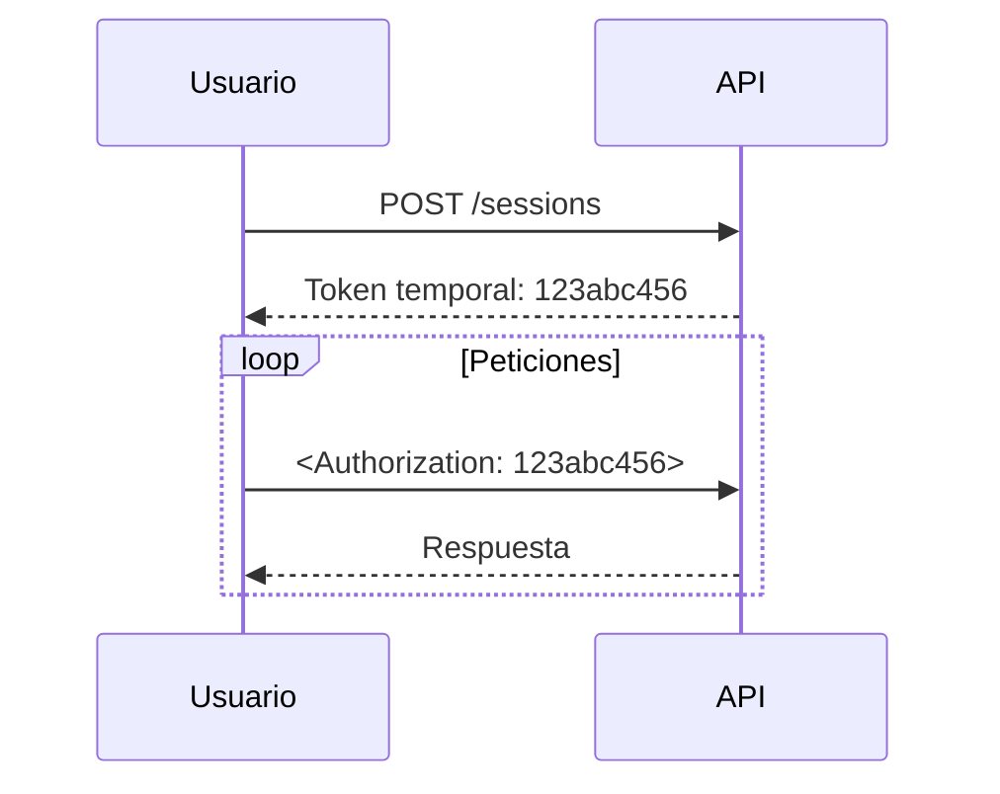

**TTPS Opción Ruby 2019**

# Trabajo Práctico Integrador

Se te ha solicitado implementar un conjunto de servicios backend para dar soporte al frontend de una aplicación de gestión de inventario y ventas de un negocio local.

La interfaz de usuario ya se encuentra desarrollada e implementada, por lo que la especificación de los servicios que ésta utiliza se encuentra ya definida y cerrada, tal como se describe en el apartado **Servicios a implementar**. La aplicación debe ser implementada utilizando Ruby on Rails en su [última versión estable](https://rubygems.org/gems/rails), creando una aplicación que funcionará [estrictamente como API](https://guides.rubyonrails.org/api_app.html) y utilizará el estándar [JSON:API](https://jsonapi.org/) para los intercambios de información (más información sobre esto en el apartado **Sobre el uso de JSON:API**).

La implementación debe estar debidamente respaldada por tests de unidad que corroboren el correcto funcionamiento del  modelo de datos, y de cualquier otra entidad que merezca la pena ser testeada.

## Dominio del problema

La aplicación se encargará de gestionar el inventario y las ventas de un negocio, de manera que deberá permitir realizar operaciones sobre los elementos del dominio que se detallan a continuación.

  
<b>Nota:</b> la estructura aquí detallada de y para los elementos del dominio es orientativa, describiendo los elementos <em>mínimos</em> que se espera que existan en la aplicación. Se espera que implementes las validaciones necesarias para que los modelos estén siempre consistentes.

  
Sos libre de agregar más modelos o atributos a los mismos en caso de considerarlo necesario.

### Productos (`Product`)

Los productos se identifican con un código único (alfanumérico) compuesto de tres letras y seis números, una descripción breve (hasta 200 caracteres) del producto, un detalle más extenso del mismo (texto libre, puede extenderse por más de 1.000 caracteres) y un monto unitario. Esos son los atributos mínimos de un producto, los cuales deben estar todos presentes para cualquier instancia del mismo.

Para cada producto es necesario llevar un registro del stock que se tiene, que es la cantidad de ítems de ese producto que el negocio tiene en su almacén.

### Ítems (`Item`)

Los ítems son elementos que se tienen o tuvieron en el almacén. Cada item representa un objeto (un producto) que, según su estado, puede ser vendido, y el conjunto de ítems disponibles de un mismo producto representa su stock.

Los productos pueden venderse siempre y cuando tengan la cantidad solicitada de ítems disponibles.

Cada item tiene un estado que representa la situación del mismo, siendo los posibles estados del mismo:

* **Disponible:** cuando el item se encuentra en el almacén y puede ser vendido. Los ítems en este estado conforman el stock de los productos.

* **Reservado:** cuando el item se encuentra en el almacén pero no puede ser vendido.

* **Vendido:** cuando el item ya fue vendido y, por ende, no puede volver a ser vendido.

Cuando un producto es *reservado* debe almacenarse en qué Reserva fue incluido, y la fecha en que fue reservado.

Cuando un producto es *vendido* debe almacenarse en qué Venta fue incluido, y la fecha en que fue vendido.

### Clientes (`Client`)

Los clientes son las personas (físicas o jurídicas) que realizan compras en el negocio. Cada uno debe tener, al menos, los siguientes datos de manera obligatoria:

* CUIL o CUIT.

* Nombre o razón social.

* Condición ante IVA (los valores posibles se describen en [este archivo de la AFIP](https://www.afip.gob.ar/fe/documentos/TABLA%20TIPO%20RESPONSABLES%20V.0%20%2025082010.xls)).

* Dirección de correo electrónico.

* Uno o más teléfonos de contacto (debe tener al menos uno).

### Reservas (`Reservation`)

Llevan el registro de los ingresos monetarios y egresos de ítems que tiene el negocio.

Cada venta debe tener, al menos, los siguientes datos obligatorios:

* Cliente para quien se reservan los ítems.

* Fecha en que se realizó la reserva.

* Usuario que asentó la reserva.

* Productos incluidos en la reserva, junto con la cantidad reservada de cada uno (debe tener al menos un producto, y todos los productos incluidos deben tener una cantidad positiva).

La confección de una reserva implica que un conjunto de ítems pasen a estado *reservado* y que queden asociados a la reserva en la que se los incluye.

No puede crearse una reserva que intente incluir un producto para el cual no se tenga el stock solicitado.

Las reservas podrán convertirse en ventas, operación mediante la cual se generará una nueva venta que contendrá todos los mismos datos que la reserva (excepto la fecha de venta, que será la del momento en que se cree la venta en lugar de copiar la fecha de reserva), y marcará los ítems asociados como *vendidos* e incluidos en la venta que se genere.

### Ventas (`Sell`)

Llevan el registro de los ingresos monetarios y egresos de ítems que tiene el negocio. 

Cada venta debe tener, al menos, los siguientes datos obligatorios:

* Cliente que compra.

* Fecha en que se realizó la venta.

* Usuario que realizó la venta.

* Productos incluidos en la venta, junto con la cantidad vendida de cada uno (debe tener al menos un producto, y todos los productos incluidos deben tener una cantidad positiva).

* En caso de ser generada a partir de una reserva, se debe asociar la venta a la reserva que la origina.

La confección de una venta implica que un conjunto de ítems pasen a estado *vendido* y que queden asociados a la venta en la que se los incluye, guardando en cada uno el valor de venta (monto unitario del producto asociado al momento de confeccionar la venta).

No puede crearse una venta que intente incluir un producto para el cual no se tenga el stock solicitado.

### Usuarios (`User`)

Los usuarios de la aplicación son aquellos autorizados a realizar peticiones a la API. En el siguiente apartado (**Autenticación**) se detalla cómo debés implementar el mecanismo de autenticación de los usuarios para realizar las operaciones.

En los casos en que se deba guardar qué usuario creó una Reserva o una Venta, el usuario que realiza la petición a la API será el que deba asociarse a éstas.

Los usuarios deben tener, al menos, un nombre de usuario único y clave para autenticarse.

## Autenticación

Las peticiones deben ser autenticadas mediante el uso tokens temporales para evitar que un usuario del sistema realice peticiones en nombre de otro. Para esto, el token obtenido mediante el servicio de inicio de sesión (`login`, detallado en **Servicios a implementar**) debe enviarse en todas las peticiones subsiguientes en la cabecera `Authorization`.

De esta manera, toda petición recibida que requiera que el usuario se encuentre identificado obtendrá qué usuario está realizando la petición mediante el token recibido por la cabecera.

## Servicios a implementar

Los servicios que tenés que implementar son los detallados a continuación.

### Servicios que no requieren token de autenticación

#### `POST /usuarios`

Crea un usuario con los datos provistos en la petición. Los atributos que se reciben son los correspondientes al modelo Usuario.

#### `POST /sesiones`

Inicia sesión con un usuario, cuyos nombre de usuario y clave se reciben en el cuerpo de la petición en los parámetros `u` y `p`, respectivamente. De ser correctos el nombre de usuario y contraseña, se debe generar un token temporal para el usuario y retornarlo, junto con los datos del usuario autenticado, en un atributo `token` para que el frontend lo guarde y lo utilice en las peticiones a servicios que requieran dicho token. La validez del token es de 30 minutos, pasados los cuales se deberá volver a identificar el usuario (mediante este mismo servicio) para así generarle un nuevo token.

### Servicios que requieren token de autenticación

#### `GET /productos`

Retorna todos los productos que se tienen, filtrándolos por alguno de los siguientes criterios, según el valor recibido _opcionalmente_ en el parámetro `q` de la petición:

* `in_stock` (filtro por defecto, en caso que no se especifique uno): retorna únicamente los productos con stock disponible.

* `scarce`: retorna aquellos productos cuyo stock es de entre 1 y 5 unidades.

* `all`: retorna todos los productos, aún aquellos sin stock disponible.

La cantidad máxima de elementos a retornar en este servicio es de `25`.

#### `GET /productos/:codigo`

Retorna la información referente al producto identificado por el código recibido en el parámetro `codigo`.

En caso de no existir el producto solicitado, se deberá devolver un HTTP status `404 Not found`.

#### `GET /productos/:codigo/items`

Retorna todos los items asociados al producto identificado por el código recibido en el parámetro `codigo`. Para cada item se debe incluir el estado del mismo y el valor de venta.

En caso de no existir el producto solicitado, se deberá devolver un HTTP status `404 Not found`.

#### `POST /productos/:codigo/items`

Crea ítems para el producto identificado por el código recibido en el parámetro `codigo`. En el cuerpo de la petición se recibe la cantidad de ítems a crear, que debe ser mayor que cero.

Los ítems creados se generan en estado *disponible*.

#### `GET /reservas`

Retorna todas las reservas que aún no se han convertido en ventas. Para cada reserva retornada se debe incluir únicamente la fecha de reserva, el nombre o razón social del cliente, y el monto total de la reserva (basado en el monto unitario de los productos).

#### `GET /reservas/:id`

Retorna la información de la reserva identificada por el parámetro `id`.

En caso de solicitarse la inclusión de los ítems asociados a la reserva mediante un *compound document*, la respuesta deberá incluir también dichos elementos (siempre siguiendo lo definido para estos casos en el estándar JSON:API). De la misma forma, se podrá pedir la inclusión de la venta asociada como un *compound document*.

#### `POST /reservas`

Crea una reserva con los atributos que se reciben como parámetros en el cuerpo de la petición (respetando lo definido por el estándar JSON:API para la estructura de las peticiones), incluyendo los productos y cantidades de éstos que se solicitan para la reserva.

En caso de encontrarse algún error de validación, no deberá crearse la reserva y la respuesta de la API deberá contener el detalle de los errores encontrados, respondiendo con un HTTP status adecuado. Por el contrario, en caso de éxito, retorna los datos de la reserva generada.

#### `PUT /reservas/:id/vender`

Convierte la reserva identificada por el parámetro `id` en una venta, sólo en caso que la reserva aún no haya sido convertida en una venta.

#### `DELETE /reservas/:id`

Borra una reserva existente, volviendo sus ítems asociados al estado *disponible*. Las reservas sólo pueden borrarse cuando aún no han generado una venta.

#### `GET /ventas`

Retorna todas las ventas realizadas por el usuario que envía la petición. Para cada venta retornada se debe incluir únicamente la fecha de venta, el nombre o razón social del cliente, y el monto total de la venta (basado en la suma de los valores de venta de los ítems asociados).

#### `GET /ventas/:id`

Retorna la información de la venta identificada por el parámetro `id`, siempre y cuando la misma haya sido creada por el usuario que envía la petición; en caso contrario debe retornar un HTTP status `404 Not found`. En caso de solicitarse la inclusión de los ítems asociados a la venta mediante un *compound document*, la respuesta deberá incluir también dichos elementos (siempre siguiendo lo definido para estos casos en el estándar JSON:API).

#### `POST /ventas`

Crea una nueva venta con los atributos que se reciben como parámetros en el cuerpo de la petición (respetando lo definido por el estándar JSON:API para la estructura de las peticiones), incluyendo los productos y cantidades de éstos que se solicitan para la venta.

En caso de encontrarse algún error de validación, no deberá crearse la venta y la respuesta de la API deberá contener el detalle de los errores encontrados, respondiendo con un HTTP status adecuado. Por el contrario, en caso de éxito, retorna los datos de la venta generada.

## Sobre el uso de JSON:API

El estándar JSON:API, que se encuentra actualmente en su [versión 1.0](https://jsonapi.org/format/) (la versión 1.1 está en desarrollo), define los aspectos necesarios para establecer intercambios de información mediante una API. No se enfoca en la tecnología con la que se genera o procesa la información intercambiada, sino que apunta a definir el contrato que permitirá que las comunicaciones se puedan llevar a cabo, interpretando de manera clara la semántica de las peticiones y de las respuestas.

Si bien este estándar es ampio y abarca muchos puntos importantes del intercambio, para el presente trabajo (para simplificar el desarrollo) acotaremos la adopción de JSON:API a lo sumo a las siguientes partes:

* Tipo MIME.

* Estructura de las peticiones.

* Estructura de las respuestas.

* Documentos compuestos ([*compound documents*](https://jsonapi.org/format/1.0/#document-compound-documents)).

Es bueno destacar en este punto que esta lista no es cerrada, es decir que sos libre de utilizar otros elementos de la especificación en caso de considerarlo necesario.

## Restricciones técnicas

La persistencia debés realizarla con alguna base de datos relacional (recomendamos `MySQL`/`MariaDB` o `PostgreSQL`).

La estructura de la base de datos debés definirla mediante el uso de [migraciones de ActiveRecord](https://guides.rubyonrails.org/active_record_migrations.html).

Podés utilizar las gemas que consideres necesarias para asistirte en la implementación de la funcionalidad solicitada en este enunciado, siempre y cuando definas claramente las restricciones de versiones adecuadas sobre las mismas.

La versión de Ruby a utilizar debe estar en la rama estable del lenguaje (actualmente `2.6`).

Para los tests de unidad pueden utilizarse las librerías vistas en la materia: `minitest` (en modalidad clásica o _spec_) o `rspec`.

## Modalidad de las entregas

La entrega deberá realizarse **de manera individual** mediante el curso de la materia en [la plataforma de Cátedras](https://catedras.info.unlp.edu.ar/), en una tarea destinada a tal fin, y se hará incluyendo la URL de un repositorio git disponible on-line y, en caso de haberse desplegado la API en Heroku, el link a la dirección pública de la aplicación Ruby on Rails corriendo en Heroku. En el repositorio se deberá incluir todo el código fuente necesario para el correcto funcionamiento de la aplicación Rails desarrollada, entre los que deberá estar presente un archivo `README` con indicaciones claras sobre cómo se puede poner en funcionamiento la aplicación, inicializar la base de datos (de ser necesario), etc.

Tener en cuenta que el repositorio debe poder se accedido por cualquiera de los docentes de la cátedra.

Para la primera entrega será **opcional** la subida del proyecto al PaaS [Heroku](https://heroku.com), pero para quienes deban presentarse a la reentrega del TPI esto será obligatorio. A tal fin, se podrá utilizar el *tier* gratuito de esa plataforma (detallado en [su página de precios](https://www.heroku.com/pricing)).

## Fechas de entrega

El presente Trabajo Práctico Integrador tiene 2 (dos) posibles fechas de entrega, establecidas tiempo antes de la publicación del enunciado en el [Cronograma de actividades](https://catedras.info.unlp.edu.ar/mod/url/view.php?id=23722) de la cursada.

  <b>Importante:</b> La primera fecha de entrega es de caracter obligatorio, por lo que quien no haya presentado <em>algo</em> en primera instancia no podrá acceder al recuperatorio del Trabajo Práctico Integrador pautado para febrero de 2020.

